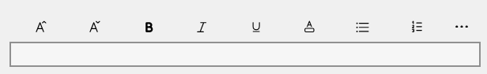

# Using the RichEditToolbar control

The `MADE.UI.Controls.RichEditToolbar` element is a custom-built UI element that works with [Uno's supported platforms](https://platform.uno/) that provides customizable and extensible collection of buttons that activate rich text features in an associated [RichEditBox](https://docs.microsoft.com/en-us/uwp/api/Windows.UI.Xaml.Controls.RichEditBox?view=winrt-22000).

Shown below is the visuals for the control in its default state.



## Example usage

```xml
<Page
    x:Class="ChipBoxSample.MainPage"
    xmlns="http://schemas.microsoft.com/winfx/2006/xaml/presentation"
    xmlns:x="http://schemas.microsoft.com/winfx/2006/xaml"
    xmlns:controls="using:MADE.UI.Controls"
    xmlns:d="http://schemas.microsoft.com/expression/blend/2008"
    xmlns:mc="http://schemas.openxmlformats.org/markup-compatibility/2006"
    xmlns:win="http://schemas.microsoft.com/winfx/2006/xaml/presentation"
    Background="{ThemeResource ApplicationPageBackgroundThemeBrush}"
    mc:Ignorable="d">

  <Grid>
      <Grid.RowDefinitions>
          <RowDefinition Height="Auto" />
          <RowDefinition Height="*" />
      </Grid.RowDefinitions>

      <controls:RichEditToolbar
          x:Name="RichEditToolbarControl"
          TargetRichEditBox="{x:Bind RichEditBox}"
          ShowFontSizeOptions="True"
          ShowTextColorOptions="True"
          ShowListStyleOptions="True">
          <controls:RichEditToolbar.CustomOptions>
              <AppBarSeparator />
              <AppBarButton x:Name="SaveButton" Icon="Save" Label="Save" />
              <AppBarButton x:Name="UndoButton" Icon="Undo" Label="Undo" />
              <AppBarButton x:Name="RedoButton" Icon="Redo" Label="Redo" />
          </controls:RichEditToolbar.CustomOptions>
      </controls:RichEditToolbar>

      <win:RichEditBox x:Name="RichEditBox" Grid.Row="1" />
  </Grid>
</Page>
```

## Supporting Uno Platform

Unfortunately, Uno Platform doesn't currently support the use of `RichEditBox`.

The control has been custom built now to structure around the unsupported direct attachment to a `RichEditBox` exposing events that allow a developer to use the control in a different context in Uno Platform applications.

You can listen for these changes by hooking onto the following `RichEditToolbar` events:

- FontSizeChanged
- FontStyleChanged
- TextColorChanged
- ListStyleChanged

These are fired when the user changes the font size, font style, text color, or list style. Each event provides an event argument that provides the new values for that setting.

## Customizing the ChipBox

The control has many customization properties that are exposed to tailor the experience for your application.

### Custom toolbar options

As well as the out-of-the-box options available, the `RichEditToolbar` allows developers to extend the options with additional custom options.

These can be added to the `CustomOptions` collection on the control either via XAML or in code.

```xml
<controls:RichEditToolbar>
    <controls:RichEditToolbar.CustomOptions>
        <AppBarButton x:Name="SaveButton" Icon="Save" Label="Save" />
        <AppBarButton x:Name="UndoButton" Icon="Undo" Label="Undo" />
        <AppBarButton x:Name="RedoButton" Icon="Redo" Label="Redo" />
    </controls:RichEditToolbar.CustomOptions>
</controls:RichEditToolbar>
```

### Custom text color options

Exposed on the `RichEditToolbar` is a `CustomTextColorOptions` property that allows you to provide your own custom set of colors to display in the text color options panel.

Here's an example of adding these via code.

```csharp
private static readonly IList<RichEditToolbarTextColorOption> CustomTextColorOptions =
            new List<RichEditToolbarTextColorOption>
            {
                new() {Name = "Pastel pink", Color = "#ff80ff"},
                new() {Name = "Pastel orange", Color = "#ffc680"},
                new() {Name = "Pastel yellow", Color = "#ffff80"},
                new() {Name = "Pastel green", Color = "#80ff9e"},
                new() {Name = "Pastel blue", Color = "#80d6ff"},
                new() {Name = "Pastel purple", Color = "#bcb3ff"},
            };

this.RichEditToolbar.CustomTextColorOptions = this.CustomTextColorOptions;
```

### Showing font size options

By default, font size options are shown to the user when using the control out-of-the-box.

If these options are not desired, set the `ShowFontSizeOptions` property to `False`.

### Showing text color options

By default, text color options are shown to the user when using the control out-of-the-box.

If these options are not desired, set the `ShowTextColorOptions` property to `False`.

### Showing list style options

By default, list style options are shown to the user when using the control out-of-the-box.

If these options are not desired, set the `ShowListStyleOptions` property to `False`.
